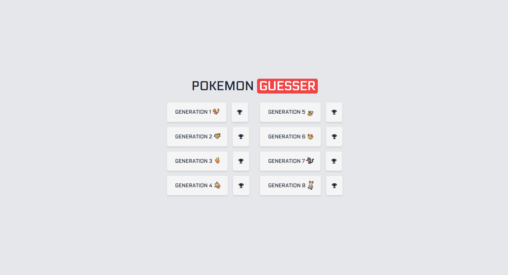
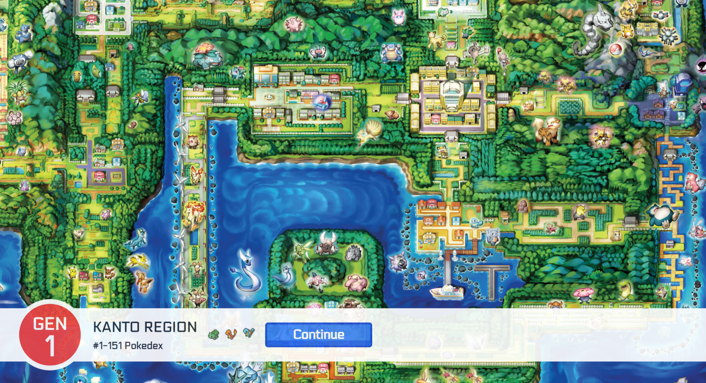
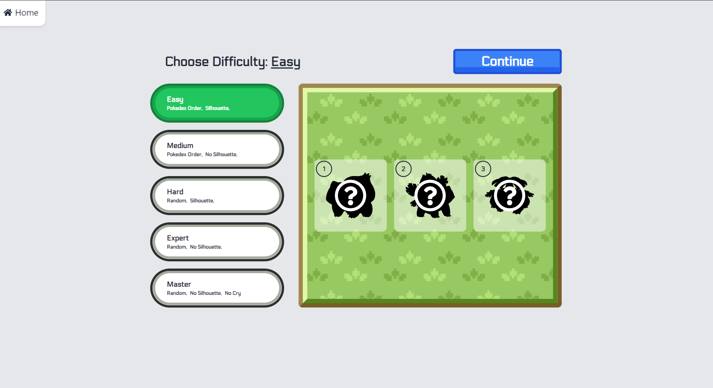
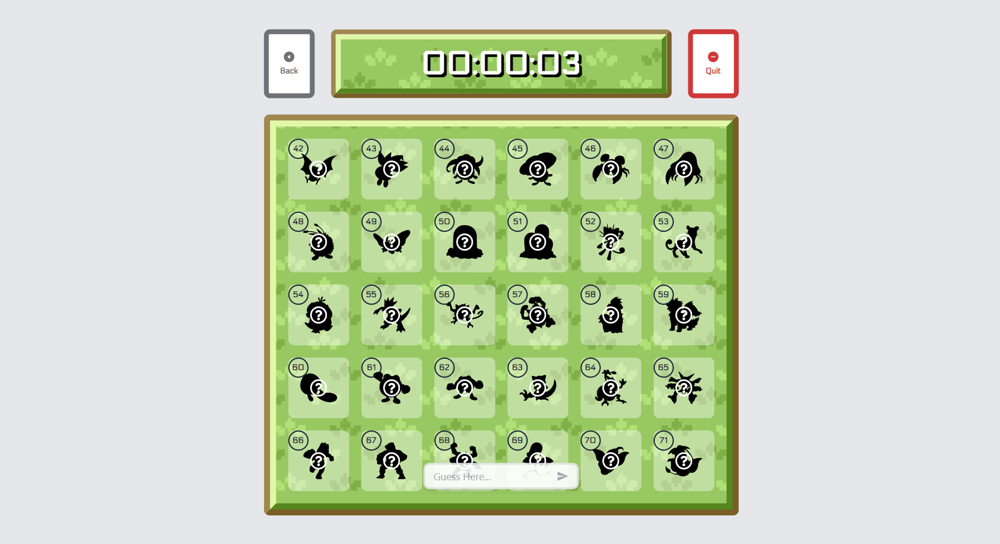
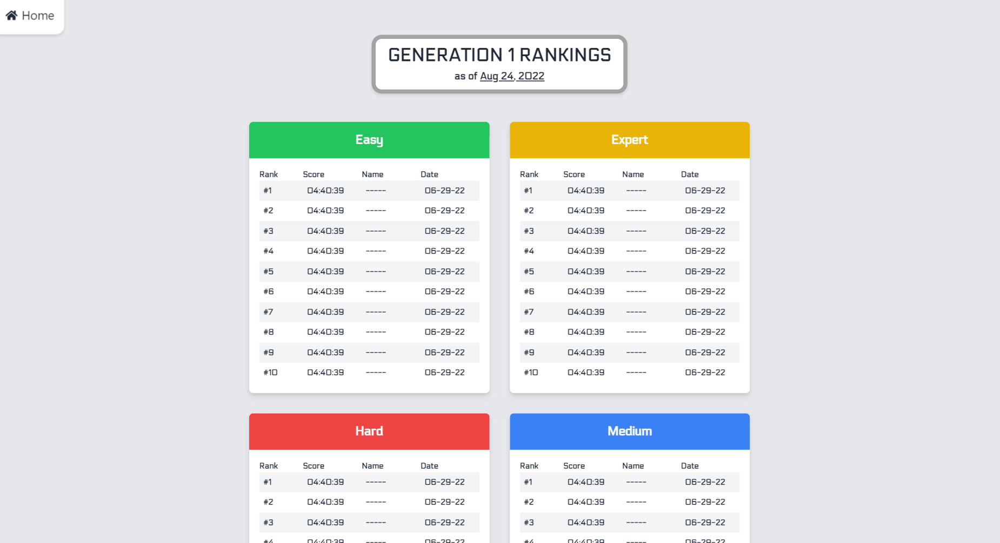

# Pokemon Guesser

> A web app guessing game that uses various Pokemon's silhouette and/or cry.

## Objective

> To build upon a previous project that was developed for a hackathon and polish
> it with more features, more pokemons, and more animations.

## Screenshots

<ul style="display:flex flex-direction:column">
 

    
    

</ul>

## Demo

<a href="https://jonathancarpena.me/demo/Pokemon%20Guesser" target="_blank" rel="noopener noreferrer">Click
Here</a>

## Features

-  5 Game difficulty options.
   -  Easy: Pokedex Order + Pokemon Silhouette.
   -  Medium: Pokedex Order + No Pokemon Silhouette.
   -  Hard: Random Order + Pokemon Silhouette.
   -  Expert: Random Order + No Pokemon Silhouette.
   -  Master: All Pokemon + No Pokemon Silhouette + No Pokemon Cry
-  Pokemon Generations 1-8.
   -  Pokedex ID #1-905
-  High Score Table for each Pokemon generation and different levels.
-  Desktop Only.

## Technologies

### Front End:

-  React
-  React Router
-  Tailwind CSS
-  Axios
-  Netlify

### Back End:

-  MongoDB
-  Express
-  Node.js
-  Heroku

## Installation & Setup

### Install

Clone down this repository. You will need node and npm installed globally on
your machine.

```
$ git clone https://github.com/jonathancarpena/pokemon-guesser.git
```

1. Install project folder `npm install`
1. Install frontend packages `cd frontend` `npm install`
1. Install backend packages `cd backend` `npm install`

### Environment Variables

To run this project, you will need to add the following environment variables to
your `.env` file inside the server folder. `MONGO_URI`: Register a new cluster
in MongoDB Atlas and record your Mongo URI

### Scripts

Development mode. Open http://localhost:3000 to view it in the browser. Server
will run on PORT:5000

```
npm run dev
```

Server-side. (PORT:5000) Open http://localhost:5000 to access.

```
npm run server
```

Client-side. (PORT:3000) Open http://localhost:3000 to view it in the browser.

```
npm run client
```

## Setup

Clone down this repository. You will need node and npm installed globally on
your machine.

```
$ git clone https://github.com/jonathancarpena/nathans-meal-prep.git
```

1. Install project folder `npm install`
1. Install client packages `cd client` `npm install`
1. Install server packages `cd server` `npm install`

   ## Environment Variables

To run this project, you will need to add the following environment variables to
your `.env` file inside the server folder.

`MONGO_URI`: Register a new cluster in MongoDB Atlas and record your Mongo URI

`TOKEN_KEY`: a randomly generated string of numbers and letters. (Ex.
"8c6b1abd9d8c44eb")

## Scripts

Development mode. Open http://localhost:3000 to view it in the browser. Server
will run on PORT:5000

```
npm run dev
```

Server-side. (PORT:5000) Open http://localhost:5000 to access.

```
npm run server
```

Client-side. (PORT:3000) Open http://localhost:3000 to view it in the browser.

```
npm run client
```

## Summary

### Why I built this project:

-  To provide the client an application that'll allow them to display their
   products as well as provide them a system that allows them to freely create,
   modify, and delete meals without having to build a completely new website.

### What was the focus of the project:

-  Create a content managing system that is explicit and easy to use.
-  Implement a global state that tracks the user's "Bag" state.
-  Complete the project within the timeframe the client asked for.

### How this project is built:

-  Redux is used to keep track of the global state such as the user's bag, the
   appearance of a modal, the presence of the admin user, and the user's current
   session.
-  Page routes are managed using React Router.
-  The page folders are organized similar to Next.js structure.
-  Customer orders, business open dates, and meal information are recorded in
   MongoDB.
-  REST API routes are created using Node and Express.
-  Meal Images are hosted through Firebase.
-  REST API is hosted through Heroku.
-  Client is hosted through Netlify.

### Reflection

-  Working on this project not only allowed me to exercise my backend skills,
   but I was also able to work with time constraints. Knowing that there was a
   deadline, helped with figuring out a task list.
-  If I were to make this project better, I would experiment with using MongoDB
   and GridFS to potentially replace Firebase, incorporate animation throughout
   the application, and more personality to the design itself.
